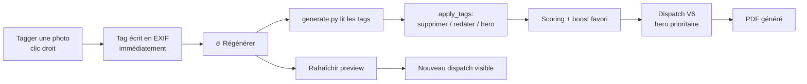

# 🖼️ Serveur de Prévisualisation — Photo Album Generator

Serveur Flask pour prévisualiser l'album photo, taguer les photos via l'interface web,
et régénérer l'album en un clic.

## 🚀 Lancement rapide

```bash
# Depuis la racine du projet
python3 preview_server.py --photos /root/mael_onedrive --port 8888
```

Ou via le script:

```bash
./scripts/start_preview.sh
```

Puis ouvrir [http://localhost:8888](http://localhost:8888).

## 🔧 Options

| Option | Défaut | Description |
|--------|--------|-------------|
| `--photos` | `/root/mael_onedrive` | Répertoire des photos JPG |
| `--port` | `8888` | Port d'écoute |
| `--host` | `0.0.0.0` | Adresse d'écoute |
| `--debug` | désactivé | Mode debug Flask |

## 🏷️ Tags disponibles

Les tags sont **écrits directement dans les métadonnées EXIF** de la photo (UserComment).
Ils persistent entre les sessions et sont relus par le pipeline de génération.

| Tag | Type | Effet |
|-----|------|-------|
| `⭐ hero` | booléen | Force la photo en page héroïque (template N3 ou N7) |
| `❤️ favori` | booléen | Boost le score ×1.20 (plafonné à 1.0) |
| `🗑️ supprimer` | booléen | Exclut la photo de l'album |
| `📅 redater` | texte (date) | Remplace la date EXIF pour le tri chronologique |
| `📝 texte` | texte | Texte/légende personnalisée affichée sur la photo |

## 🖱️ Utilisation

1. **Visualiser l'album** — chargement automatique des 19 pages de preview
2. **Clic droit** sur une photo → menu contextuel avec tous les tags
3. **Cocher/Décocher** un tag dans le menu → écriture EXIF immédiate
4. **Filtres** dans la sidebar → masquer/afficher les photos par tag
5. **Recherche** dans la sidebar → filtrer par nom de fichier
6. **🔄 Régénérer l'album** → lance `generate.py` en arrière-plan avec les tags actuels
7. **Rafraîchir la preview** → recharge automatiquement après régénération

## 🔄 Workflow complet



## 📡 API REST

| Endpoint | Méthode | Description |
|----------|---------|-------------|
| `/api/photos` | GET | Liste toutes les photos avec tags et scores |
| `/api/preview` | GET | Structure complète de l'album (pages, photos, zones) |
| `/api/photo/<name>/info` | GET | Infos détaillées d'une photo |
| `/api/photo/<name>/thumbnail` | GET | Vignette 200px |
| `/api/photo/<name>/tag` | POST | Ajouter/modifier un tag |
| `/api/photo/<name>/tag/<tag>` | DELETE | Supprimer un tag |
| `/api/photo/<name>/tags` | DELETE | Supprimer tous les tags |
| `/api/tagged-photos` | GET | Liste des photos taguées |
| `/api/regenerate` | POST | Lancer la régénération |
| `/api/regenerate/status` | GET | Statut de la régénération en cours |

## 🧪 Exemple de tagging (script)

```python
from album_generator.tag_manager import add_tag, read_tags
from pathlib import Path

photo = Path("/root/mael_onedrive/DSC00001.JPG")

# Tagger comme héro et favori
add_tag(photo, "hero", True)
add_tag(photo, "favori", True)

# Vérifier
print(read_tags(photo))
# → {'hero': True, 'favori': True}

# Marquer pour suppression
add_tag(photo, "supprimer", True)

# Redater une photo
add_tag(photo, "redater", "2012-06-15")

# Ajouter une légende
add_tag(photo, "texte", "Mael à la plage")
```

## 🐛 Dépannage

| Problème | Cause | Solution |
|----------|-------|----------|
| "Aucun score disponible" | Scoring pas encore lancé | Cliquer sur "Régénérer l'album" |
| La preview ne se rafraîchit pas | Cache des scores | La régénération invalide le cache automatiquement |
| Les tags ne sont pas pris en compte | Tag non lu par `tag_engine` | Vérifier avec `read_tags(photo_path)` |
| Erreur "Port déjà utilisé" | Un autre processus écoute | `kill $(lsof -ti:8888)` |
| Photos non trouvées | Mauvais chemin `--photos` | Vérifier que le dossier existe et contient des .JPG |
